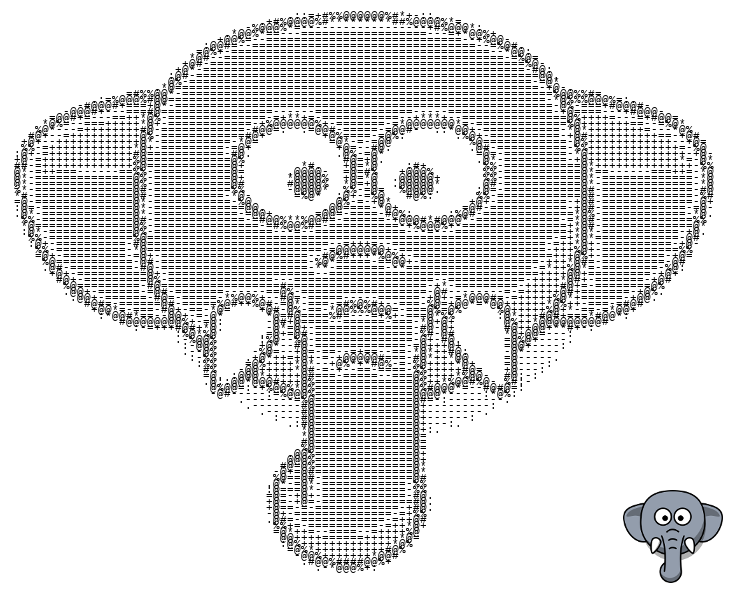

# imgToAscii

A JavaScript implementation of a image to ascii converter.

## How to use

Include the imgToAscii.js file
```
<script src="src/imgToAscii.js"></script>
```
then just create a new imgToAscii object with the image address and optionaly the alphabet: (0 - simpler shades, 1 - more complex shades) - default is 0

```
<script>
let ele = new imgToAscii('elefante.png');
ele.display();
</script>
```

You can also resize your image passing a second parameter between 0 and 1 as percentage. e.g.: 0.5 = 50% - Will reduce the size of your image in 50% both vertical and horizontal (width, height).

```
<script>
let eu = new imgToAscii('eu.png',0.5);
eu.display();
</script>
```

## Important

The ascii art depends on a monospace font to work properly. You should consider that 1 pixel in your image is going to be translated to 1 char in Ascii. e.g.: if a image is 100 pixels wide, it's going to take 100 chars of space on your page, unless you do something about it.

The imgToAscii should work with remote images:
```
let img = new imgToAscii('http://site.com/image.png');
```
but it might not because of cross-origin settings. Keep that in mind.

----

A similar code is running on my [photoEditor](https://victorribeiro.com/photoEditor) to generate a image of the ascii code (what?!)




[](https://www.codetriage.com/victorqribeiro/imgtoascii)
